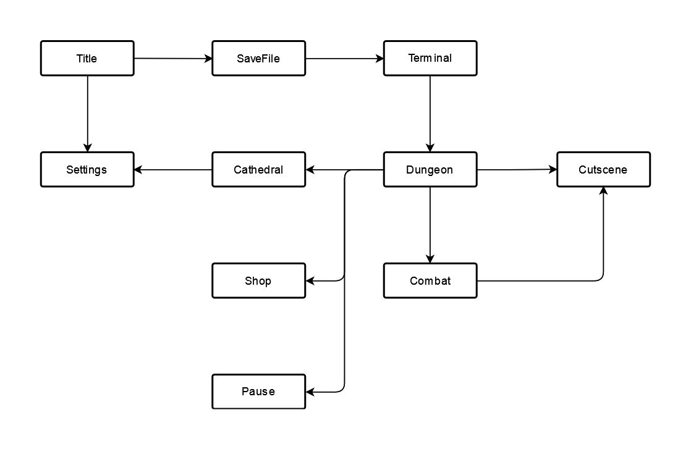

# tower-of-babel
The Tower of Babel is a work-in-progress Shin Megami Tensei fangame, created with Godot, Aseprite, and Blender.

# Code Guidelines

## Game States
The game is organized into distinct states, each with their own logic on controlling the flow of the game.

## User Interface Structure
The UI code is organized into four interfaces as described below. Godot does not support actual interfaces, so instead interpret them as a general description of how scenes with the corresponding names act within the structure of the game.

### Component
Base interface for all UI scenes.

- `signal completed`
- `func initialize(Variant data ...) -> void`
- `func clear() -> void`
- `[coroutine] func transition_in() -> void`
- `[coroutine] func transition_out() -> void`

### Unit [Button, Icon] extends Component
A small, immutable and instantiable representation of some sort of information. Units should not be standalone, but rather controlled entirely by some parent component that initializes them. Container units can have other unit children, but they should not manage the visibility or state of those units

### Widget extends Component
A small, instantiable representation of some sort of information. Widgets are the same as units, except that they are mutable and usually represent a constantly changing state. Widgets should not handle other components.

### Handler extends Component
A controller object that manages the appearance of other components, especially units. Handlers are characterized by having multiple states, set externally through methods. Any methods that accept input from the player should have the prefix `query`.

## Code Order
In general, the order of code structures should be:
- `class_name MyClass`
- `extends AnotherClass`
- `const`
- `enum`
- `@export` variables
- `@onready` variables
- state variables
- virtual methods
- signal methods
- other methods

## Notes
The rules above are only guidelines. There may be some mistakes in the code or better approaches to certain problems. If you see any glaring issues, raise it on this repository. Thank you!
